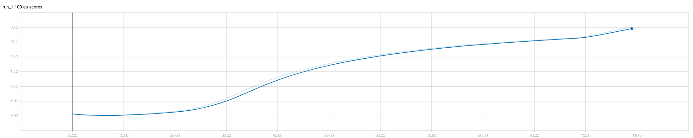
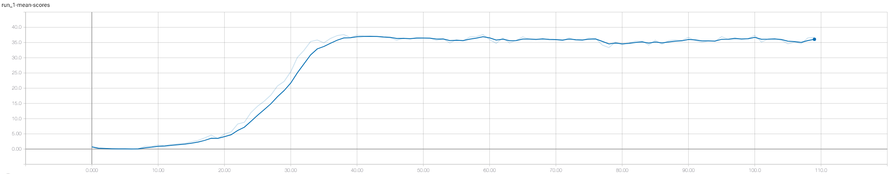

# Report for the Continuous Control project

## Implementation
In this project an algorithm is trained to steer a robot arm with 2 joints to keep the "hand" in a moving target sphere.
The algorithm is trained by feeding it 33 visual observations that contains position, rotation and (angular) velocities
of the arm and target sphere. The actions are defined as values between -1 and +1 and correspond to the torque in 2
dimensionfor both joints.

Every step the hand is inside the sphere it is rewarded with a value of +0.04. The duration of an episode is
1000 steps resulting in a theoretical maximum score of 40 per episode

## Algorithm
The used algorithm is a Deep Deterministic Policy Gradient (DDPG, for the original article see
[here](https://arxiv.org/pdf/1509.02971.pdf). This project contains a slightly modified version of the
Udacity DDPG pendulum implementation as can be found
[here](https://github.com/udacity/deep-reinforcement-learning/tree/master/ddpg-pendulum).

After a number of trainings the following hyperparameters were used for the final run:

|Hyperparameter|Value|
|--------------|:----|
|BUFFER_SIZE|1e5|
|BATCH_SIZE|128|
|GAMMA|0.99|
|TAU|1e-3|
|LR_ACTOR|1e-4|
|LR_CRITIC|3e-4|
|WEIGHT_DECAY|0.0001|

The implementation contains 2 models, Actor and Critic. Both with a 3 layer model with Relu activation in the first 2
layers. They both have 256 nodes on the first layer and 128 on the second layer. Differences between the 2 models:
- Actor has Tanh activation on the last layer.
- Critic has Relu activation on the last layer
- Critic the action input added in the second layer.

## Results
For this particular run the environment was solved in 110 episodes. This was surely one of the better runs since the
last 10 runs or anything between 110 and 160 was witnessed. See resulting score diagrams below:

The mean score per episode diagram show that after slightly less than 40 episodes the agents stops learning and
implementation is just waiting till the average score is above 30.

## Future work
There doesn't seem a lot of obvious improvements, the model trains pretty quickly and solves the environment easily.
Most important parts to improve are probably the randomness involved with the starting weights. The effect is profound
on the training, anything between 110 and 160 episodes needed to solve the environment have been encountered. One run
even didn't start converging after 60 episodes. Interesting steps might be to see how the agent behaves without the
trained model and no noise, this should start to get close to the theoretical limit of 40. Other implementation
improvements could be gathering more "meta" data of the different runs to see if there might be more indicators for
improvements.
